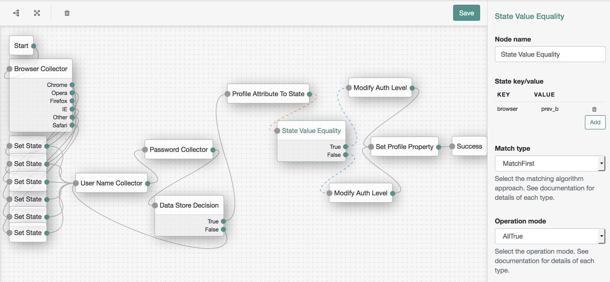

<!--
 * The contents of this file are subject to the terms of the Common Development and
 * Distribution License (the License). You may not use this file except in compliance with the
 * License.
 *
 * You can obtain a copy of the License at legal/CDDLv1.0.txt. See the License for the
 * specific language governing permission and limitations under the License.
 *
 * When distributing Covered Software, include this CDDL Header Notice in each file and include
 * the License file at legal/CDDLv1.0.txt. If applicable, add the following below the CDDL
 * Header, with the fields enclosed by brackets [] replaced by your own identifying
 * information: "Portions copyright [year] [name of copyright owner]".
 *
 * Copyright 2017 ForgeRock AS.
 * Portions copyright 2018 David Luna.
-->
# State Value Equality Node

A simple authentication node for ForgeRock's [Identity Platform][forgerock_platform] 5.5 and above. This node will compare values currently held in an authenticating session's shared state, resulting in the boolean true output if they are all equal, false if any are not. 

When multiple key/value pairs are entered to be checked, the number of them which must return true is configured by the **operation mode** selection.

As values returned from the shared state may be returned as Sets, this node operates in a special way when a shared state value is returned as a Collection (Set, List, etc.), determined by the choice of **match type** parameter. 

These states operate as:

* **MatchAny** The objects will be compared for equality, if either (or both) of them are Collections, all the elements in the Collection(s) will be tested, and true will be returned if any of them match.
* **MatchFirst** The objects will be compared for equality, if either (or both) of them are Collections, only the first element in the Collection(s) will be tested, true will be returned if this element matches the other. This is the default operational mode.
* **MatchExact** The objects will be compared directly for equality, regardless of whether they are a Collection or not, true will be returned if they are equal.
* **MatchAll** The objects will be compared for equality, if both of them are Collections, all elements must match, if one is a Collection, it must be of size one, and its first element be equal to the second object to return true.

The operation modes operate as:

* **AllTrue** All of the key/value pairs must return true according to the Match Type selected.
* **OneTrue** Any one of the key/value pairs must return true according to the Match Type selected.

Configuration Screenshot

The above screenshot demonstrates the flexibility of authentication nodes by generating a very (VERY!) simple device fingerprinting journey using granular authentication nodes. By storing the user's current browser in the authentication shared state and comparing it against the previous browser used to authenticate as stored in the user's profile we are able to increase or decrease their authentication level, before storing the new previous browser value in the profile.

Copy the .jar file from the ../target directory into the ../web-container/webapps/openam/WEB-INF/lib directory where AM is deployed.  Restart the web container to pick up the new node.  The node will then appear in the authentication trees components palette.

The code in this repository has binary dependencies that live in the ForgeRock maven repository. Maven can be configured to authenticate to this repository by following the following [ForgeRock Knowledge Base Article](https://backstage.forgerock.com/knowledge/kb/article/a74096897).
        
The sample code described herein is provided on an "as is" basis, without warranty of any kind, to the fullest extent permitted by law. ForgeRock does not warrant or guarantee the individual success developers may have in implementing the sample code on their development platforms or in production configurations.

ForgeRock does not warrant, guarantee or make any representations regarding the use, results of use, accuracy, timeliness or completeness of any data or information relating to the sample code. ForgeRock disclaims all warranties, expressed or implied, and in particular, disclaims all warranties of merchantability, and warranties related to the code, or any service or software related thereto.

ForgeRock shall not be liable for any direct, indirect or consequential damages or costs of any type arising out of any action taken by you or others related to the sample code.

[forgerock_platform]: https://www.forgerock.com/platform/  
